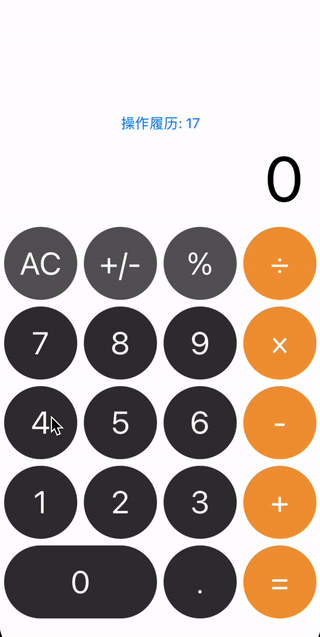
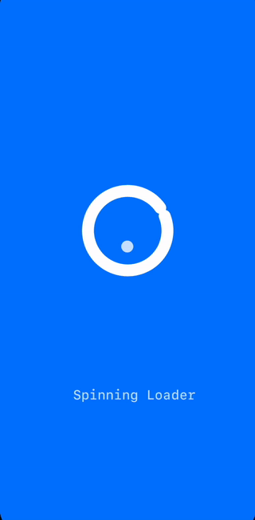
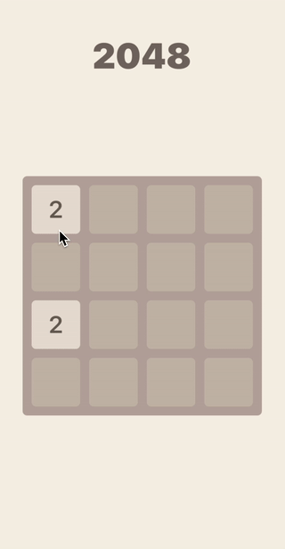
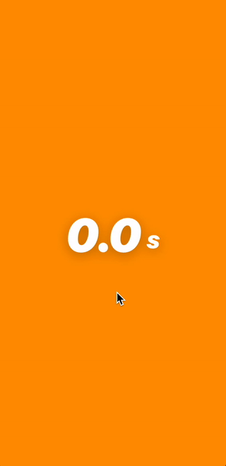
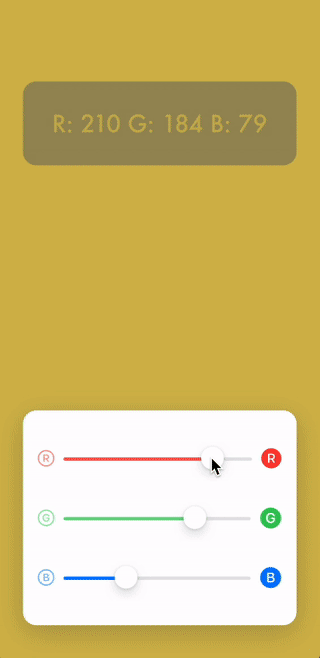
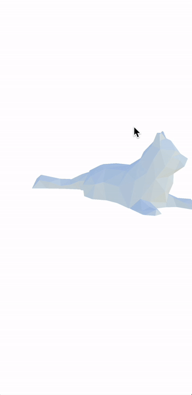
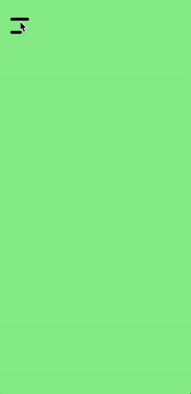
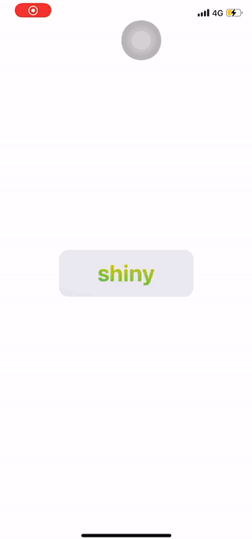
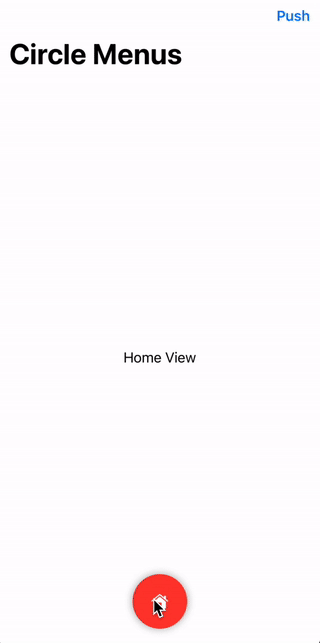

# SwiftUIs 学习Demo

 

When learning and using `SwiftUI`, if you have any questions, you can join the SwiftUI QQ Group: **471020594** to discuss communication.

### 1. Calculator

  
View running results

### 2. PokeMaster

  
View running results

### 3. Card Animation

  
View running results

### 4. Basic Animation

  
View running results

### 5. Notes

  
View running results

### 6. Design Code

  
View running results

### 7. Flip Animation

  
View running results

### 8. Landmarks

  
View running results

### 9. SpinningLoader Animation

  
View running results

### 10. InfinityView Animation

  
View running results

### 11. LoginView

  
View running results

### 12. GithubLoad

  
View running results

### 13. LikeView

  
View running results

### 14. CircleLoader

  
View running results

### 15. RemoveButton

  
View running results

### 16. AnimatedBallsView

  
View running results

### 17. AnimationTabbar

  
View running results

### 18. Tabbar

  
View running results

### 19. 2048

  
View running results

### 20. Github Search API For MVVM

  
View running results

### 21. Time

  
View running results

### 22. ColorMix

  
View running results

### 23. SceneCatView with SceneKit

  
View running results

### 24. TransCardView

  
View running results

### 25. BreathView

  
View running results

### 26. SideMenu

  
View running results

### 27. Shine

+ 随陀螺仪的转动，颜色随着变化

  
View running results

### 28. Shimmer

  
View running results

### 29. Circle Menu

  
View running results

### 30. Charts

  
View running results

